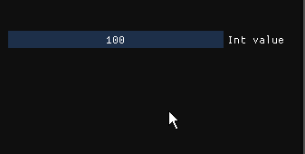

# imgui_dragex
Imgui::DragFloat and ImGui::DragInt with runtime customizable speed with the middle mouse button. Totally inspired in Houdini UI.

    #include "imgui/imgui_dragex.h"
    static int ival = 100;
    ImGui::DragIntEx("Int value", &ival, 1, 0, INT_MAX );

    static float fval = 100;
    ImGui::DragFloatEx("float value", &fval, 1, -FLT_MAX, FLT_MAX);

Same for ImGui::DragFloat2Ex, ImGui::DragFloat3Ex & ImGui::DragFloat4Ex

# Integration

    Drop the two files inside the imgui folder in your imgui installation
    Add #include "imgui/imgui_dragex.h" in your source
    Change ImGui::DragInt to ImGui::DragIntEx (same for DragFloat)
    Replace the 3rd argument speed value to 1

